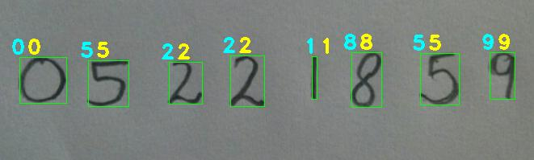

# Handwritten digit recognition with Keras, SVM, and OpenCV
With MNIST data set, machine learning was used to read single handwritten digits. Now we can extend that to reading multiple digits, as shown below. The underlying neural network does digit classification. We used OpenCV contours to detect numbers in the picture. This can be quite useful in various ML applications like reading labels in the store, license plates, advertisements, etc. But if you are looking for more reliable techniques, you should use SSD, YOLO, etc.



## Project structure
Separate models prepared for digit recognition: DNN using Keras and SVM using Sklearn. The DNN is done using a CNN with convolution, maxpool, and FC layers that classify each detected region into ten different digits. The classifier showed 95% accuracy on the test set. Multi-class linear SVM uses HOG features and got 92% accuracy on the test set. We tested the repo on various examples and found that they work pretty well.

Here, we will implement the following steps—each step performed in a separate python file that is mentioned after each step colorized with red. The next steps describe code step by step. 

## Install required packages
Using pip you can install the required packages for this project easily. Go to the project directory and run the following command:
```
pip install -r requirements.txt
```

### Step 1:
Calculate the HOG features for each sample in the database for the SVM model – trainSVM.py

The first step is import the required modules -

```python
import joblib
from sklearn import datasets
from skimage.feature import hog
from sklearn.svm import LinearSVC
import numpy as np
from collections import Counter
from sklearn.datasets import fetch_openml
```

We will use the joblib package to save the classifier in a file to use the classifier again without performing training each time. Calculating HOG features for 70000 images is costly, so we will save the classifier in a file and load it whenever we want to use it. As mentioned, Datasets package will be used to download the MNIST database for handwritten digits. We will use skimage.feature.hog class to calculate the HOG features and sklearn.svm.LinearSVC class to perform prediction after training the classifier. We will store our HOG features and labels in numpy arrays. The next step is to download the dataset using the sklearn.datasets.fetch_openml function. It will take some time as 55.4 MB will be downloaded for the first time.

```python
# Load the dataset
dataset = fetch_openml('mnist_784')
```

Once the dataset is downloaded, we will save the images of the digits in a NumPy array features and the corresponding labels, i.e., the number in another NumPy array labels as shown below –

```python
# Extract the features and labels
features = np.array(dataset.data, 'int16') 
labels = np.array(dataset.target, 'int')
```

Next, we calculate the HOG features for each image in the database and save them in another NumPy array named hog_feature.

```python
# Extract the hog features
list_hog_fd = []
for feature in features:
fd = hog(feature.reshape((28, 28)), orientations=9, pixels_per_cell=(14, 14), cells_per_block=(1, 1))
list_hog_fd.append(fd)
hog_features = np.array(list_hog_fd, 'float64')
```

In line 17 we initialize an empty list list_hog_fd, where we append the HOG features for each sample in the database. So, in the for loop in line 18, we calculate the HOG features and append them to the list list_hog_fd. Finally, we create a NumPy array of hog_features containing the HOG features, which will be used to train the classifier. This step will take some time, so be patient while this piece of code finishes.

To calculate the HOG features, we set the number of cells in each block equal to one, and each cell is of size 14×14. Since our image is of size 28×28, we will have four blocks/cells of size 14×14 each. Also, we set the length of the orientation vector equal to 9. So our HOG feature vector for each sample will be of size 4×9 = 36. We are not interested in visualizing the HOG feature image, so we will set the visualize parameter to false.

### Step 2:
Train a multi-class linear SVM with the HOG features of each sample along with the corresponding label, then save generated model into a .pkl file – trainSVM.py
The next step is to create a Linear SVM object. Since there are 10 digits, we need a multi-class classifier. The Linear SVM that comes with sklearn can perform multi-class classification.

```python
# Create an linear SVM object
clf = LinearSVC()
```
We preform the training using the fit member function of the clf object.

```python
# Perform the training
clf.fit(hog_features, labels)
```

The fit function required 2 arguments –one an array of the HOG features of the handwritten digit that we calculated earlier and a corresponding array of labels. Each label value is from the set — [0, 1, 2, 3,…, 8, 9]. When the training finishes, we will save the classifier in a file named digits_cls.pkl as shown in the code below -

```python
# Save the classifier
joblib.dump(clf, "digits_cls.pkl", compress=3)
```

Up till this point, we have successfully completed the first task of preparing our SVM classifier.

### Step 3:
Construct the CNN model with comvolution, maxpool and FC layers, then save generated model into a .h5 file – trainCNN.py
In this step we construct a CNN model using Keras. First step is to import required modules - 

```python
import numpy
import matplotlib.pyplot as plt
from keras.datasets import mnist
import keras 
from keras.layers import Dense, Conv2D,Dropout,MaxPooling2D,Flatten
from keras.models import Sequential 
```

We will use Keras API to load MNISt data. After that separate data into train and test  sections. We use train section to train our classifier and test section to evaluate the generated classifier. We know that the images are all pre-aligned (e.g. each image only contains a hand-drawn digit), that the images all have the same square size of 28×28 pixels, and that the images are grayscale. Therefore, we can load the images and reshape the data arrays to have a single color channel - 

```python
# Load & Reshaping Dataset:
def load_dataset():
	(x_train, y_train), (x_test, y_test) = mnist.load_data()

	x_train = x_train.reshape(60000,28,28,1)
	x_test = x_test.reshape(10000,28,28,1)

	print('x_train shape:', x_train.shape)
	print(x_train.shape[0], 'train samples')
	print(x_test.shape[0], 'test samples')

	y_train = keras.utils.to_categorical(y_train, num_classes)
	y_test = keras.utils.to_categorical(y_test, num_classes)
	return x_train, x_test, y_train, y_test

x_train, x_test, y_train, y_test = load_dataset()
```

Next, we need to define a baseline convolutional neural network model for the problem. The model has two main aspects: the feature extraction front end comprised of convolutional and pooling layers, and the classifier backend that will make a prediction. Every Keras model is either built using the Sequential class, which represents a linear stack of layers, or the functional Model class, which is more customizeable. We’ll be using the simpler Sequential model, since our CNN will be a linear stack of layers. We start by instantiating a Sequential model. The Sequential constructor takes an array of Keras Layers. We’ll use 3 types of layers for our CNN: Convolutional, Max Pooling, and Softmax.

```python
# Define Model:
def define_model():
	model = Sequential()
	model.add(Conv2D(32,kernel_size=(3,3), activation='relu', input_shape=(28,28,1)))
	model.add(MaxPooling2D(pool_size=(2, 2)))
	model.add(Dropout(0.25))
	model.add(Conv2D(64, (3, 3), activation='relu'))
	model.add(MaxPooling2D(pool_size=(2, 2)))
	model.add(Dropout(0.25))
	model.add(Flatten())
	model.add(Dense(128, activation='relu'))
	model.add(Dropout(0.5))
	model.add(Dense(10, activation='softmax'))
```

- num_filters, filter_size, and pool_size are self-explanatory variables that set the hyperparameters for our CNN. 
- The first layer in any Sequential model must specify the input_shape, so we do so on Conv2D. Once this input shape is specified, Keras will automatically infer the shapes of inputs for later layers. 
- The output Softmax layer has 10 nodes, one for each class.

Before we can begin training, we need to configure the training process. We decide 3 key factors during the compilation step.
- The optimizer. We’ll stick with a pretty good default: the Adam gradient-based optimizer. Keras has many other optimizers you can look into as well.
- The loss function. Since we’re using a Softmax output layer, we’ll use the Cross-Entropy loss. Keras distinguishes between binary_crossentropy (2 classes) and categorical_crossentropy (>2 classes), so we’ll use the latter. See all Keras losses.
- A list of metrics. Since this is a classification problem, we’ll just have Keras report on the accuracy metric.

Here’s what that compilation looks like:
```python
	model.compile(optimizer=keras.optimizers.Adam(lr=0.001), 	loss='categorical_crossentropy', metrics=['accuracy'])
	print(model.summary())
	return model
```

Training a model in Keras literally consists only of calling fit() and specifying some parameters. There are a lot of possible parameters, but we’ll only supply these:
- The training data (images and labels), commonly known as X and Y, respectively.
- The number of epochs (iterations over the entire dataset) to train for.
- The validation data (or test data), which is used during training to periodically measure the network’s performance against data it hasn’t seen before.

```python
# Train Model:
model.fit(x_train, y_train, validation_data=(x_test, y_test),verbose=1, epochs=25, batch_size=128)
```

### Step 4:
Use generated model to classify detected handwritten numbers in provided samples photo_1.png and photo_2.png – performRecognition.py
This file contains required procedures to load an image, perform number detection on provided image then use SVM and CNN models to recognize each detected number from image. To provide further images, just change name of image file in line 16 of this file. Following picture is shows how this bunch of code works.
